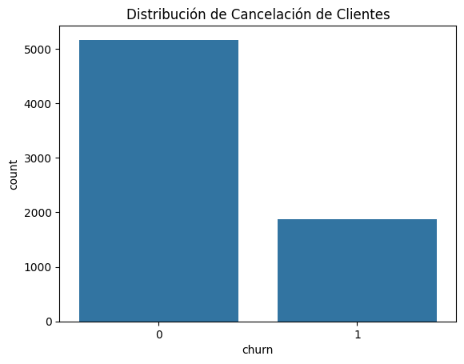
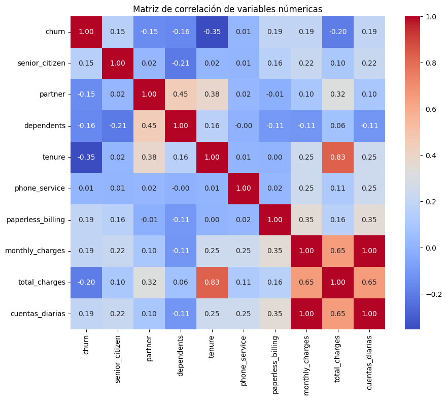
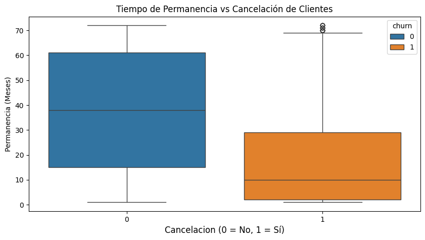
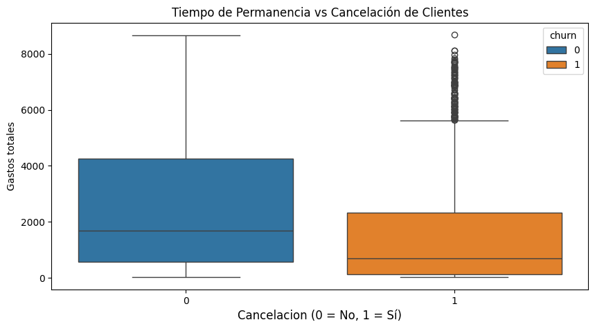
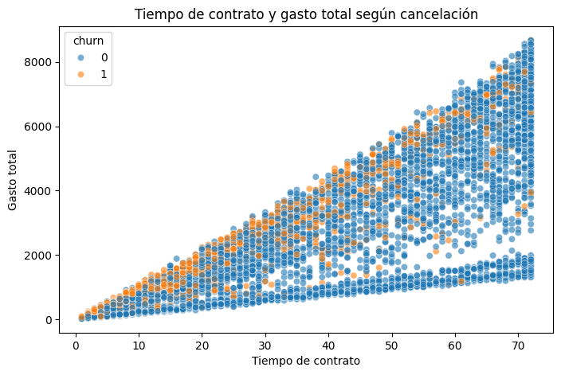
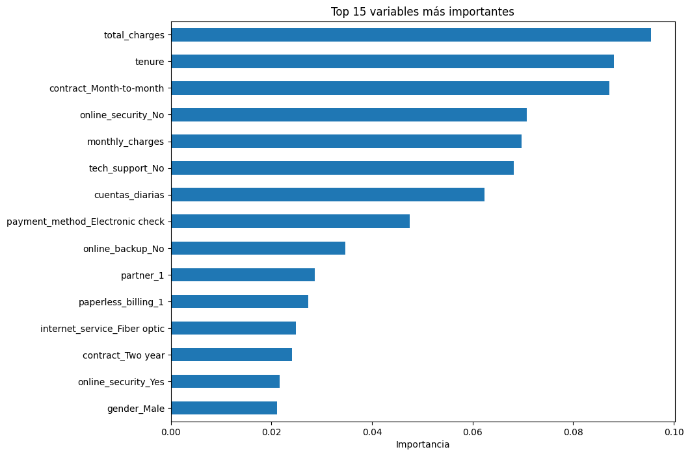

Telecom X Parte 2 - Challenge - Predicción de Cancelación de Clientes 

## 📊 Base de datos
Se utiliza una base que  corresponde a clientes de la empresa de telecomunicaciones Telecom  X que incluye variables  monetarias, demográficas y servicios contratados .

El objetivo es predecir la variable **Churn**, que indica si el cliente canceló o no los servicios de Telecom X

## 📌 Descripción del proyecto
El objetivo del proyecto es desarrollar modelos de regresion y Machine learning para predecir la cancelacion de los servicios de Telecom X, evento que afecta 
a los ingresos, operaciones y planeacion de la empresa Telecom X. Por ello utilizamos variables cercanas a los clientes y los tipos de servicio que ofrece Telecom X para
identificar cuales influyen más en que un cliente cancele servicios de Telecom X
---
## 📌 Preparacion base de datos
La base de datos ya fue tratada eliminando duplicados. valores nulos y espacios en blanco esta base esta en el repositorio con el nombre d_telecom.csv

## 📌 Variables 
Clasificamos las variables en
  -**Variables numéricas:**
    -Tiempo de permanencia del cliente
    -Gasto mensual
    -Gastos Totales
 -**Variables categóricas**
    -Tipo de contrato
    -Servicio de internet 
    -Genero
    -Pareja
    -Servicio telefónico
    -Multiples lineas
## 📌 Tratamiento de las variables
-Se elimino la columna customer_id por no afectar directamente a los modelos para el calculo de la cancelacion de servicios.
-Codificamos las variables categoricas con OneHotEncoder para mejorar la precision del modelo 
-Nuestra variable de cancelacion de servicios, Churn, no tiene proporciones adecuadas por lo que es necesario un balanceo utilizamos SMOTE para corregir.

  

-Analisis de correlacion de las variables para identificar variables significativas
 

### División de datos

La base de datosfue dividido en:

- **80% datos de entrenamiento**
- **20% datos de prueba**

## 📌 Análisis dirigido

-Evaluación de tiempo de permanencia vs cancelacion de clientes
    
    
-Evaluación de Gastos totales vs cancelacion de clientes
    
    
-Tiempo contratado y gasto total de cancelacion
    

## 🤖 Modelos Evaluados
Seleccionamos dos modelos para predecir la cancelación de clientes:

- **Regresión Logística**
- **Random Forest**

Los modelos fueron evaluados utilizando las siguientes métricas:
- Accuracy
- Precision
- Recall
- F1-score
- Matriz de confusión

# 📌 Analisis de la importacion de las variables
  

 📌 Conclusiones

El análisis permitió identificar variables clave que influyen en la cancelación de clientes.

Entre los factores más relevantes se encuentran:

- Gastos totales
- Meses de permanencia
- Tipo de contrato

El modelo Random Forest mostró un desempeño superior para predecir la cancelación, al capturar relaciones más complejas entre las variables.

---
  
